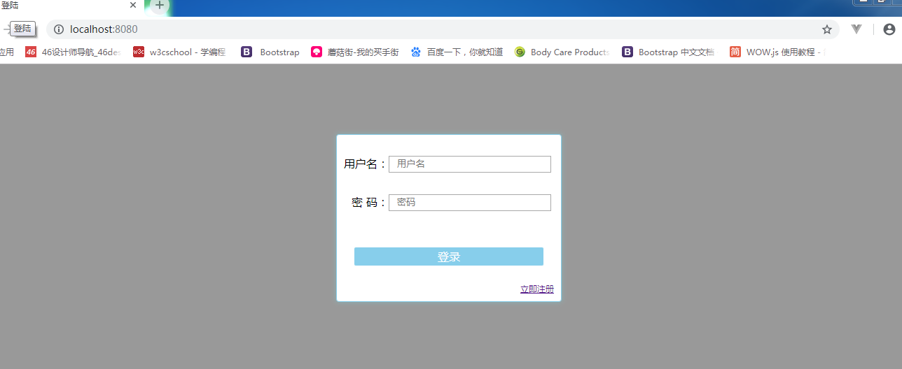
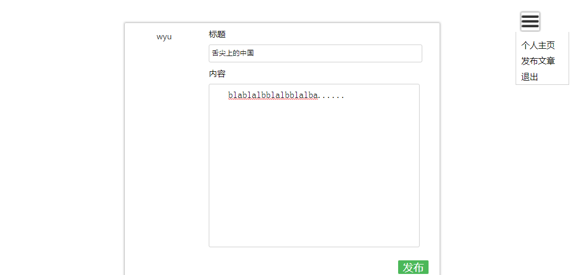

<!DOCTYPE html>
<html lang="en">
<head>
	<meta charset="UTF-8">
	<title>Document</title>
</head>
<body>
	
使用node.js,express实现简单的登录，注册，发布，留言功能，页面有些粗糙

	
本地登录：localhost:8080/

	
	
发布文章：

</body>
</html>